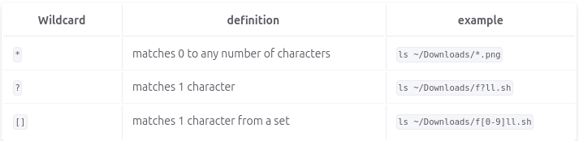

<<<<<<< HEAD
# Notes 6

 

## * WildCard
  * Matches 0 to any number of characters 

### Example :
* List all the txt files 
     * `ls *.txt` 
* Move all `.sh` files 
    *  `mv wildcard_extra_practice/*.sh wildcard_extra_practice/scripts/`
* Lists all directories without giving a list of thier contents 
    * `ls -1d wildcard_extra_practice/*/`

## ? WildCard 
* used to indicated 1 or more characters that are unknown 
### Example :
  * Lists files that have a certain number of characters (but are unknown)
      * `ls -1X wildcard_extra_practice/*.????`
  * Used to search for a file that contains 1 character 
      * `ls file?.txt`
  * lists files that start with a charater
      * `ls ?file.txt`
## [] WildCard 

* Matches 1 character from a set 

### Example :
  * List all the files that start with a capital letter
    * `ls wildcard_extra_practice/[A-Z]*`
  * List all the files that contain a number in their name
    * `ls wildcard_extra_practice/[0-9]`
  * Lists all files that contain a number and a letter 
    * `ls wildcard_extra_practice/[A1-A9]`

##  Brace Expansion

* Allows you to create strings that, create directories,multiple files and commands 
=======
# Notes 6

 

## * WildCard
  * Matches 0 to any number of characters 

### Example :
* List all the txt files 
     * `ls *.txt` 
* Move all `.sh` files 
    *  `mv wildcard_extra_practice/*.sh wildcard_extra_practice/scripts/`
* Lists all directories without giving a list of thier contents 
    * `ls -1d wildcard_extra_practice/*/`

## ? WildCard 
* used to indicated 1 or more characters that are unknown 
### Example :
  * Lists files that have a certain number of characters (but are unknown)
      * `ls -1X wildcard_extra_practice/*.????`
  * Used to search for a file that contains 1 character 
      * `ls file?.txt`
  * lists files that start with a charater
      * `ls ?file.txt`
## [] WildCard 

* Matches 1 character from a set 

### Example :
  * List all the files that start with a capital letter
    * `ls wildcard_extra_practice/[A-Z]*`
  * List all the files that contain a number in their name
    * `ls wildcard_extra_practice/[0-9]`
  * Lists all files that contain a number and a letter 
    * `ls wildcard_extra_practice/[A1-A9]`

##  Brace Expansion

* Allows you to create strings that, create directories,multiple files and commands 
>>>>>>> f6d57bcb4be34cfde473650710a0a98d9f22cf22
